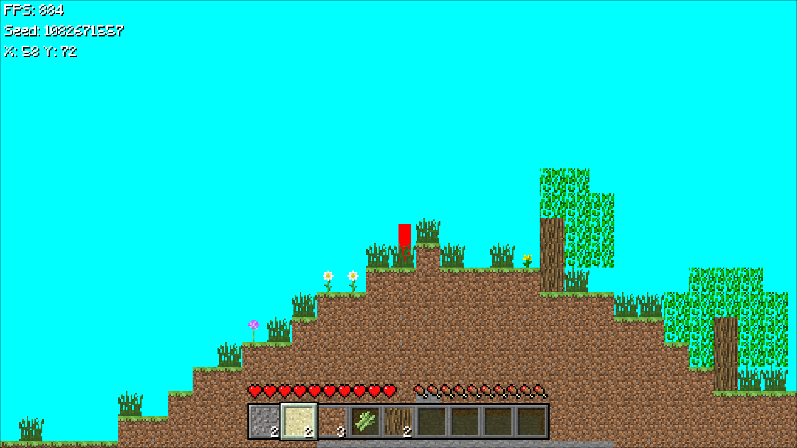

# Minecraft 2D

## About

This is one of my first big projects using [CPL](https://github.com/ColinIndieDev/ColinDev-C-Projects/tree/main/cplibrary) which is now written entirely in C even though 3D is not added yet.

## Screenshots

## Features / Gameplay
For now only these things:

- World Generation by Seeds
  - Terrain
  - Ocean
  - Trees
  - Caves
  - Ores
- Block breaking, collecting & placing
- Hotbar as inventory
- Collisions and player movement

## Dependencies

This project uses third party libraries from CPL (f.e. GLFW) but 
for Perlin Noise, it uses FastNoiseLite, a simple header only library which
is inside `src/` with the file name `noise.h`.

## ToDo

- Inventory system
- Crafting system
- Tools & Weapons
- Mobs
- Armor
- etc.
